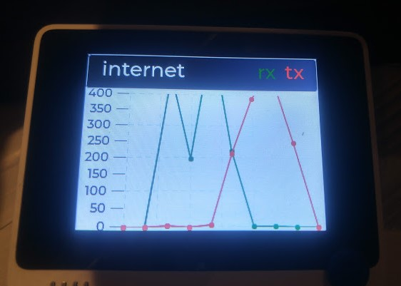

# Router stats polling

This example shows router statistics for TX/RX traffic out ETH0 which is the uplink on my router to the internet

It does this by polling using [SNMP](https://github.com/shortbloke/Arduino_SNMP_Manager) the interface link metrics.

Traffic is polled every 5sec and the last 10 values are plotted on a graph in the range 0-400Mbps.  
Adjust the traffic.cpp code for your connections range.

